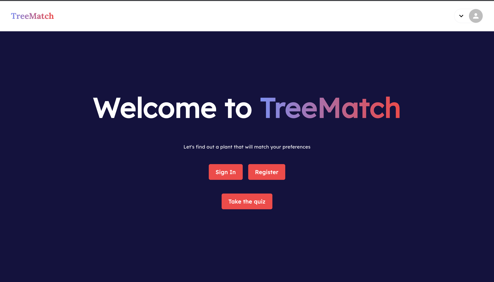
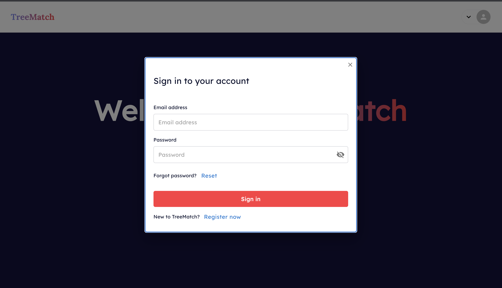
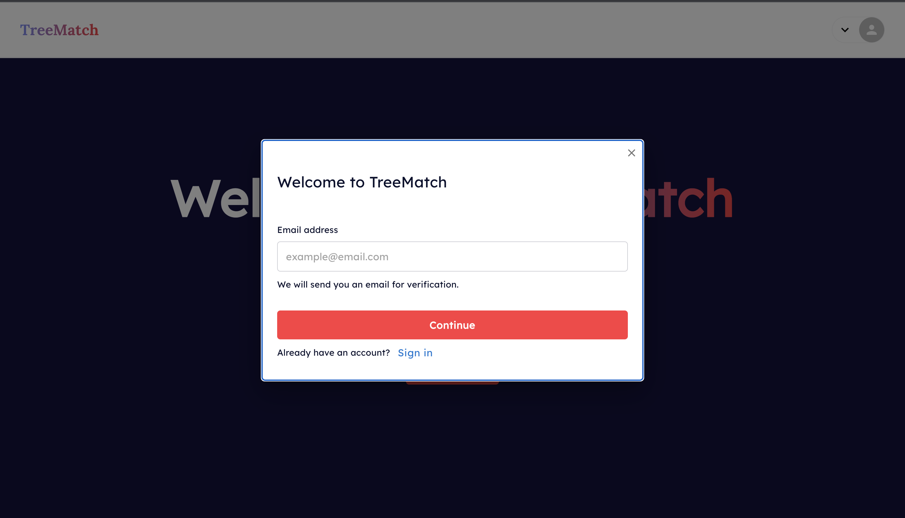
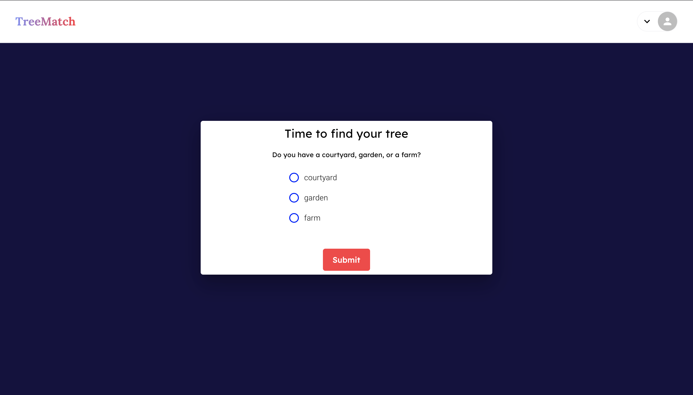
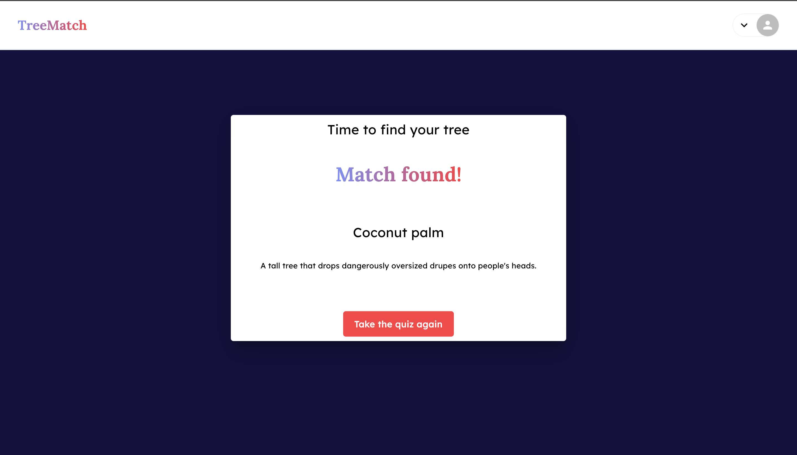

## TreeMatch

A simple, matching program designed to match a user's plant preference. 

## Running the app
### `npm start`

Runs the app in the development mode.\
Open [http://localhost:3000](http://localhost:3000) to view it in the browser.

## Tech stack

- FE Framework - React/Typescript
- Design Library - Material UI
- Forms - React Hook Forms
- Axios - HTTP Client
- Mobx - State Manager
- scss - Styling
- Yup - Form validtor

**Note**
 - I've pushed the .env files for testing purposes.
 - Sign In/Register screens are available but the implementation is not done.
 - I've desinged core compoenents for component reusibility

## Improvements
  - adding an error boundry 
    - Using a software such as sentry or bugsnag to help detect any prod build errors
  - Using a BrowserRouter or a HashRouter for routing
  - Dependency optimisation 
    - using lodash and momenths

## UI

Figma link for the wireframes  https://www.figma.com/file/SpekGUSImambbTqO8e7yyf/TreeMatch-wireframes?node-id=0%3A1

**Home**

**Sign In**

**Sign Up**

**Quiz**

**Match**

